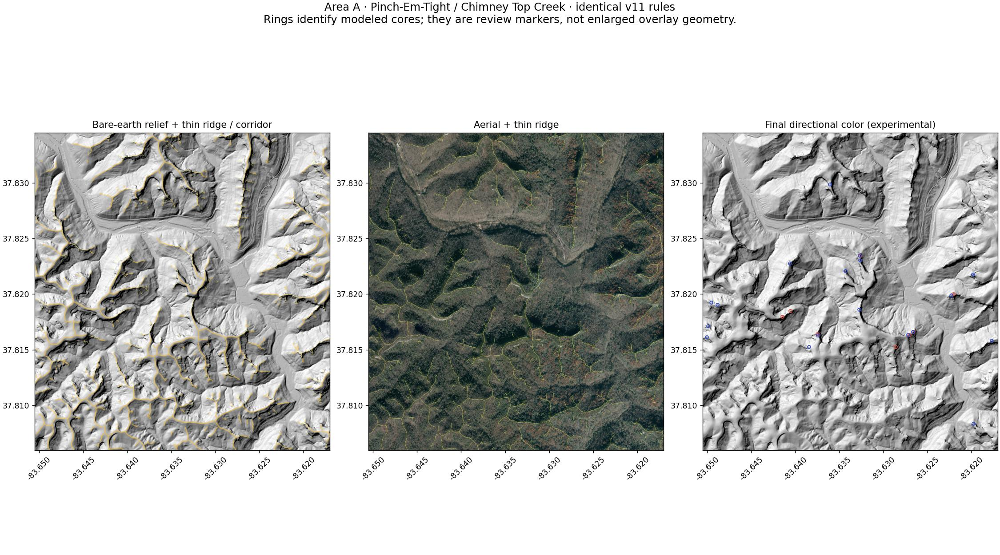
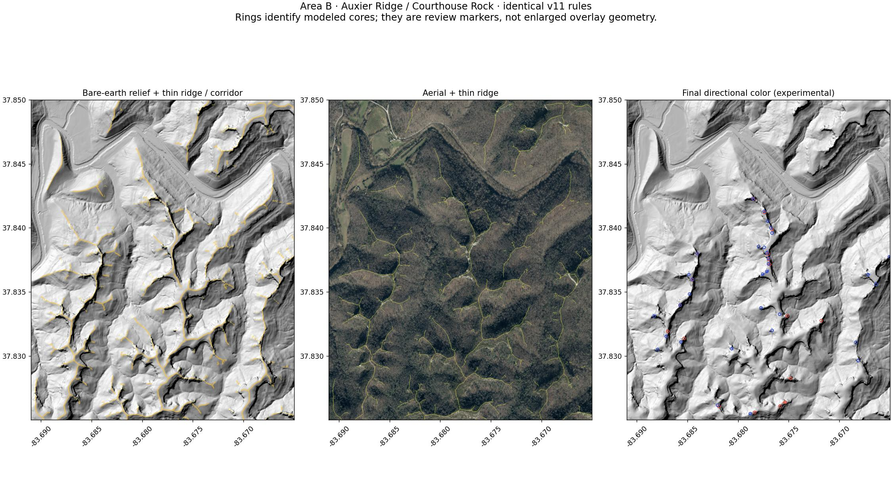

# Sunrise / Sunset v11 calibration review

Staging only. Ryan's geometry approval is pending. PR #46 remains draft and unmerged. This candidate does not authorize production or Gorge-wide generation.

## Review order

1. Select **Terrain**, open **Layers → Calibration diagnostics**, and enable only **1 · LiDAR ridge skeleton**. Follow the actual crest on both sides of Rush Branch and the fingers beside Chimney Top Creek. The yellow line must remain on the spine; mapped trails are independent context.
2. Compare **2 · Crest corridor**, then switch to **Aerial**. The corridor is at most 12 m wide, with separate slope and elevation-drop limits. Inspect exposed rim positions rather than assuming an aerial gray patch is rock.
3. Inspect **3 · Overlook / outcrop candidates** and **4 · Aerial / canopy classification** separately. Tan is measured low cover plus a low vegetation signal, not confirmed bare rock. Gray means unknown.
4. Inspect **5 · Sunrise directional pass** and **6 · Sunset directional pass** independently, then **7 · Sunrise / Sunset composite**. A blank region is not proof that no view exists.
5. Repeat at Auxier Ridge / Courthouse Rock. Exactly the same model and constants generated both areas.

| Area | Bounds (west, south, east, north) | Review focus |
| --- | --- | --- |
| A: Pinch-Em-Tight / Chimney Top Creek | -83.6505, 37.8060, -83.6170, 37.8345 | User-circled flank bands; wooded ridge fingers; true exposed crest near the intended trail-end sunrise location |
| B: Auxier Ridge / Courthouse Rock | -83.691, 37.825, -83.665, 37.850 | Narrow exposed spine versus wooded shoulders, separate eastern and western viewing sectors |





The rings in these review figures locate modeled cores for inspection. They are not colored pixels and are not used in the map overlay.

## What the visual review established

The previously staged v9 image painted wide bands on the sides of ridge fingers. The later, undeployed v10 watershed experiment omitted important continuous fingers because its sparse basin seeds did not resolve every tributary. The v11 thin-line review follows the visible branching crest geometry substantially better in Area A. Its narrow corridor no longer inherits the broad old bands. In independent Area B, the same rules follow the Auxier spine and branch away from the intervening hollows; no area-specific parameter fit was made.

The canopy review shows extensive leaf-off woodland. Color alone was inadequate: measured point-cloud height now separates tall trees from low cover before directional testing. Expanding the input buffer to 1,100 m corrected incomplete horizon coverage at display edges. Four-meter ray sampling avoids the earlier large gaps between horizon samples. No horizontal or vertical shift was applied to align a desired result.

These observations justify a staging comparison, not acceptance of every viewpoint. The final colored result remains sparse and can fragment into very small patches. Broad flat tops and narrow ledges can be missed; leaf-off gaps can yield false open-view evidence. The specific trail-end location described by Ryan is not unambiguously identified by a coordinate in the supplied screenshot, so its required strong sunrise/no-automatic-sunset behavior remains an explicit acceptance item. Do not call that positive case verified or expand the overlay until Ryan identifies and approves it on the map.

## Data and reproducibility

- Ground: Kentucky KyFromAbove Phase 2 two-foot Z-meters DEM. The official catalog confirms Phase 2 coverage here; the Phase 3 ground DEM did not provide valid local coverage. There is no silent USGS fallback in v11.
- Canopy: official Phase 2 COPC LiDAR tiles, queried at approximately four-meter hierarchy resolution. US survey feet are converted to meters before subtracting the registered bare-earth DEM. Noise and withheld returns are excluded; vegetation classes are retained. Ground-return residual percentiles are recorded per tile to flag vertical registration problems.
- Aerial: KyFromAbove Phase 3 four-band RGB/NIR orthophotography. The inspected Pinch-Em-Tight catalog tile is N107E351, with imagery dated November–December 2023 and ground elevation dated December 2022–March 2023. Other exact tiles, export parameters and fingerprints are in the input manifest. Acquisition mismatch and leaf-off conditions remain limitations.
- Display: approximately two-meter ground cells; two isolated boxes only. Fixed ridge, corridor, canopy and directional rules; no trail-derived repositioning or scores. A 1 km terrain-and-canopy horizon is sampled through seasonal east and west fans. Color uses a connected corridor walk of at most 70 m, with canopy increasing travel cost. It cannot jump a hollow or cut across a diagonal gap.
- `scripts/data/sun-calibration-inputs.json` pins all five input arrays in each area with SHA-256 identities, exact image export requests and versioned official point-cloud URLs. `public/data/map/sunrise-sunset-potential.meta.json` pins output images and model code.
- The verification workflow checks out the exact pushed commit, installs pinned dependencies, runs behavioral tests, retrieves and fingerprints the inputs, regenerates both areas and requires a clean asset diff. It has read-only repository permissions and cannot move the source branch.
- A successful verification run retains the exact DEM, aerial and combined canopy inputs for 90 days. Long-term regeneration requires the provider data to remain available or that preserved cache; changed inputs fail closed and must be reviewed explicitly.

```sh
python -m pip install -r scripts/calibration-requirements.txt
python -m unittest discover -s tests -p test_sun_calibration_model.py -v
python scripts/build-sun-calibration.py --cache /path/to/input-cache
git diff --exit-code -- public/data/map scripts/data/sun-calibration-inputs.json
```

`--record-inputs` is an explicit acquisition operation, not a way to bypass a failed fingerprint. Review any changed source before recording a new snapshot. Archived v9/v10 generator history remains in Git; their outputs are superseded, not treated as the current model.
