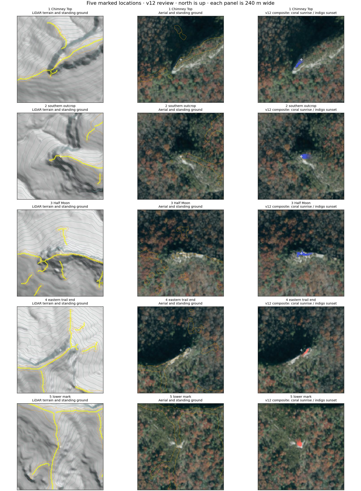
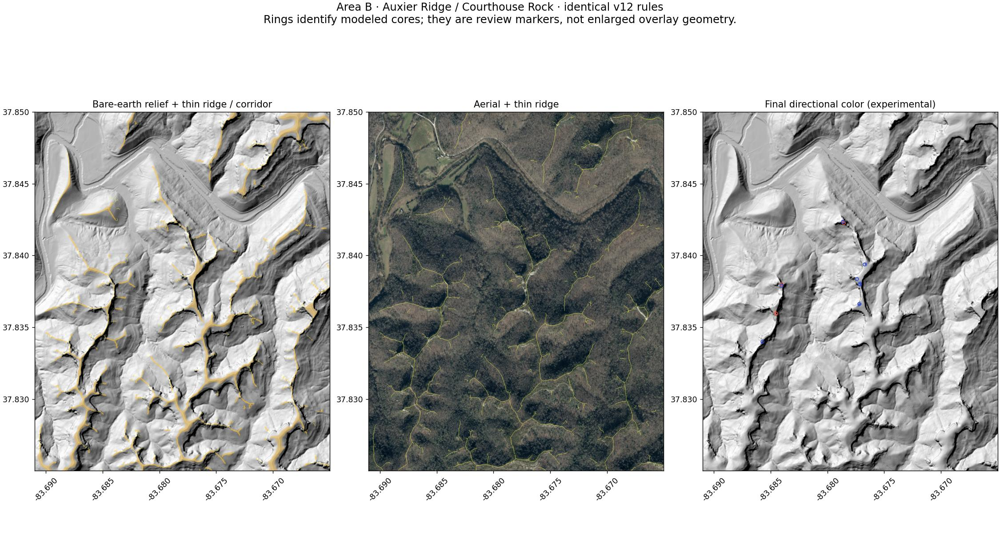

> Superseded for active Pinch-Em-Tight calibration by [v13](v13-review.md) after Ryan rejected the crest/standing-ground geometry. Auxier work is paused; this document remains historical.

# Sunrise / Sunset v12 — marked-point correction

Staging only. This supersedes v11 after Ryan identified missed and reversed views in his five-mark screenshot. It is a corrected review candidate, not Ryan's visual approval or authorization for production or Gorge-wide generation.

## The five locations

Coordinates below identify approximately 50 m review regions around the marks, not survey-grade standing coordinates. They are used only by the regression checker, never by model generation.

| Mark | Location | Required / reviewed composite |
| --- | --- | --- |
| 1 | Chimney Top Rock, 37.82270, -83.62290 | Sunset restored; no sunrise label in the review region |
| 2 | Southern exposed outcrop, 37.8217781, -83.6198311 | Sunset retained; no sunrise label |
| 3 | Half Moon Arch outcrop, 37.8199999, -83.62206 | Sunset; erroneous sunrise label removed |
| 4 | Eastern trail-end overlook, 37.81662, -83.62680 | Strong sunrise; no automatic sunset label |
| 5 | Lower marked rim, 37.8152758, -83.62861 | Small rock rim visible in aerial imagery; modeled sunrise candidate, still unverified in the field |



These are visual checks against the actual marked landforms. Counts or whole-area coverage percentages are not acceptance evidence. The composite occupies the exposed upper edges, not the entire bright cliff face below them.

## Defects corrected

- **Missing returns falsely blocked Chimney Top's westward view.** The old code rejected an entire kilometer ray if any sampled canopy cell lacked a return, including gaps across the river. The new code fills a small hole with the maximum **absolute surface elevation** in the smallest surrounding window containing measured evidence, up to 12 m along either grid axis. It never fills from a previously interpolated value, never overwrites measured open cells, and keeps larger gaps unknown. Filling canopy height instead would invent trees on adjacent high rock; that is explicitly avoided.
- **A thin ridge line was being treated as the limit of an outcrop.** Bare-earth geometry now also retains gentle, locally high ground next to the spine, with a 24 m neighborhood and no more than 4 m local relief below the nearby top. This allows flat rock platforms beyond the old six-meter crest buffer. Aerial imagery still cannot move terrain geometry.
- **Low cover was insufficient evidence of rock.** Candidates now require a connected rock-like aerial patch: fixed NDVI, brightness and chroma criteria, at least 24 m² of connected material, and measured local cover below 4 m. Dark leaf-off gaps alone do not qualify. Rock, dry ground and some vegetation can still be spectrally ambiguous.
- **Weak or narrow directional evidence produced misleading colors.** Each representative seasonal azimuth is checked through a 30° fan at 5° spacing. Six of seven rays and the actual center azimuth must pass a three-degree horizon limit and ten-meter near-field fall-away. At least 16 m² of connected candidate ground must qualify. A composite seed additionally needs strong evidence (model strength at least 0.6); a weak opposite-direction diagnostic score does not automatically create a second composite label. This strength is not a probability.
- Color spreads only through connected exposed standing ground and the narrow crest corridor, with the existing 70 m maximum and no radial blur or diagonal gap crossing. A strong color core is not expanded down the bright vertical cliff face for visibility.

No point-specific exclusion, override, manual color placement, coordinate shift or trail-derived geometry was introduced. The same final rules generated Area B without a separate fit.

## Independent area and remaining limits



Auxier's exposed spine and branching outcrops were checked against the registered LiDAR and aerial imagery. The same rules keep the cores on upper rock surfaces and leave intervening wooded slopes and hollows uncolored. This is a visual comparison, not proof that every possible viewpoint has been found.

The stricter material and seed requirements can omit small, shaded, narrow or spectrally ambiguous outcrops. Point-cloud gaps and acquisition dates remain limitations. The fifth marked rim remains a candidate without Ryan's field confirmation. The one-kilometer horizon and representative azimuths do not predict exact-date sun visibility. No wider generation or production promotion is authorized by this correction.

## Reproducibility and review

The Phase 2 DEM and COPC inputs and Phase 3 RGB/NIR imagery are unchanged from v11 and retain their pinned fingerprints. The model does not download new data merely for a visitor to enable a layer. All seven controls remain off by default, the assets are local, and staging retains noindex.

```sh
python -m unittest discover -s tests -p test_sun_calibration_model.py -v
python scripts/build-sun-calibration.py --cache /path/to/input-cache
python scripts/check-sun-calibration.py --cache /path/to/input-cache
git diff --exit-code -- public/data/map scripts/data/sun-calibration-inputs.json
```

The checker verifies the four user-identified expectations only after independent generation. The fifth is reported as unverified and is not forced to an expected result. The read-only verification workflow runs the same checks on its exact source SHA after fetching and fingerprinting provider data. Approved routes, original photograph masters, unrelated gates and the guarded Skybridge elevation cache are unchanged.

For the first review, enable **7 · Sunrise / Sunset composite** and compare the five marked locations. For geometry detail, isolate **1 · LiDAR ridge skeleton**, then **2 · Crest / standable rock-top ground**, and compare Terrain with Aerial. Review both directional diagnostic layers when a weak score does not become a composite seed.
