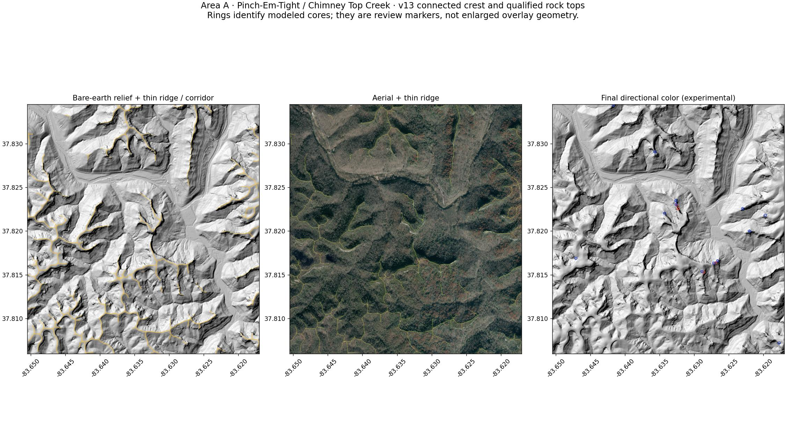
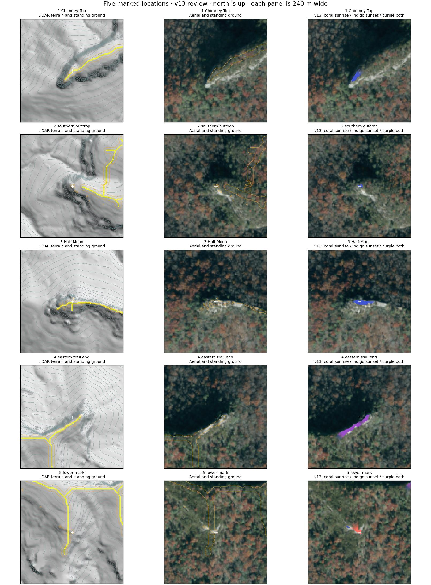
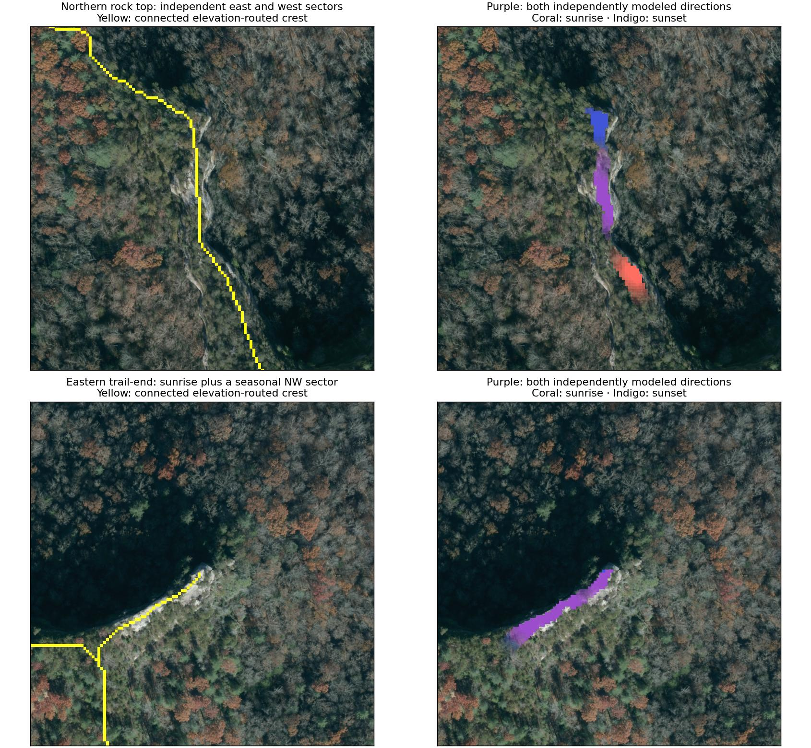

# v13 — Pinch-Em-Tight crest and rock-top correction

Status: staging candidate; Ryan's visual acceptance is pending. This pass generates and displays **Pinch-Em-Tight only**. Auxier generation and display are paused; its v12 assets and review remain historical. Production and approved route geometry are unchanged.

Ryan rejected v12's disconnected ridge fragments and orange ground below the actual tops. This correction replaces the crest extraction itself before evaluating exposed rock or sun direction.

## Review in this order

1. **1 · LiDAR ridge skeleton**, over Terrain and then Aerial: follow continuous crest limbs and their ends.
2. **2 · Crest / standable rock-top ground**: inspect the narrow crest and qualified exposed upper lips. The broad terrain-search footprint is no longer painted orange.
3. **7 · Sunrise / Sunset composite**: coral is sunrise, indigo is sunset, and **purple is both independently modeled directions**.

All seven layers remain off by default. Trails provide a comparison only; their geometry is never an input to crest placement or direction scores.

## What changed

- **Connected crest topology:** derive a connected upper-landform footprint from bare-earth elevations, extract its network, prune short terminal twigs, and route each retained limb toward higher cross-ridge ground. The footprint is a search constraint, not the displayed standing corridor. Routing cannot leave that support to bridge a hollow.
- **Cliff lip versus cliff face:** use upward ground differences for the standing-surface check. A flat top no longer inherits an artificial slope from the drop immediately beside it. The narrow crest stays within 6 m of the spine and 1.8 m below its adjacent elevation. Additional upper-lip cells require a cliff break, connected rock-like leaf-off aerial material and low measured cover before they enter the orange diagnostic or composite.
- **Independent valid directions:** retain each passing directional footprint. The previous later strength cutoff could hide a valid weaker direction. Scores now control intensity without deleting an independently passing view. Purple explicitly identifies overlap.
- **Broad rock platforms:** evaluate fall-away within 80 m, while retaining the 1 km sampled terrain/canopy horizon. The seasonal center ray and six of seven rays in its 30-degree viewing fan must pass; a connected 16-square-meter footprint is still required. A direction is never inferred from the opposite direction or from being high up.
- **Focused scope:** the generator, active map overlays, reproduction workflow and UAT expectation now cover A only. No Auxier data were reacquired or regenerated in this pass.

The official Phase 3 source is already a **leaf-off** collection. This pass also inspected 0.25 m exports at the northern exposed ridge and eastern trail-end. Those detail exports are visual review evidence; the deterministic model continues using the unchanged registered DEM, four-band aerial and point-cloud input arrays and their fingerprints. Leaf-off imagery still contains evergreen cover, branches and shadows; measured canopy remains a separate obstruction check.

Official source: [KyFromAbove Phase 3 leaf-off imagery](https://kyfromabove.ky.gov/datasets/kygeonet%3A%3Akentucky-kyfromabove-phase3-leaf-off-3-ortho-imagery/about).

## Marked-point results and dual-view evidence

| Location | Current result |
| --- | --- |
| Chimney Top Rock | Sunset retained; no sunrise |
| Southern exposed outcrop | Sunset retained; no sunrise |
| Half Moon Arch | Sunset retained; erroneous sunrise stays absent |
| Eastern trail-end | Strong sunrise retained; some cells also independently pass a seasonal northwest sunset sector |
| Lower marked rim | Unverified candidate; no field-visibility claim |
| Northern exposed ridge near 37.8230174, -83.6325674 | The same ground supports independent east and west passes; displayed purple |

At the northern ridge, the sampled east/NE and west sectors pass independently. At the eastern trail-end, due west is obstructed, while a seasonal northwest sector passes at some rock-top cells. This is why v13 can show purple there: it is a separately evaluated seasonal view, not an automatic sunset added to a sunrise point. Neither result means every sunrise or sunset is visible throughout the year.

The four user-confirmed directional positives remain regression checks. Half Moon's prohibited sunrise remains an explicit negative. The trail-end check retains its sunrise requirement and now permits a separately supported opposite direction; it no longer asserts that every western seasonal sector must be absent. The added northern dual-view check requires a shared footprint of at least four 2 m cells, rather than finding opposite colors at different places in a large review circle. These coordinates are used only after generation, never by the model.

## Validation and limits

Behavior tests cover a connected curving crest, crest centering, planar-flank and valley rejection, a flat upper lip beside a cliff, a platform beyond the centerline buffer, both directions on one open top, blocking one direction without removing the other, measured canopy, missing-data handling and connected fade. Existing route, privacy, analytics, commerce and other application checks remain in place.

The new topology is materially more coherent in the Pinch-Em-Tight terrain/aerial review, but it is still a raster-derived approximation. Small knobs, saddles, sub-cell ledges and wooded cliff rims can be missed or simplified. Rock-like aerial material is evidence, not field proof. The fifth marked rim remains unverified. Access, footing, current vegetation, weather and exact-date sun visibility are not established by these overlays. No Gorge-wide generation or production promotion is authorized by this review.
