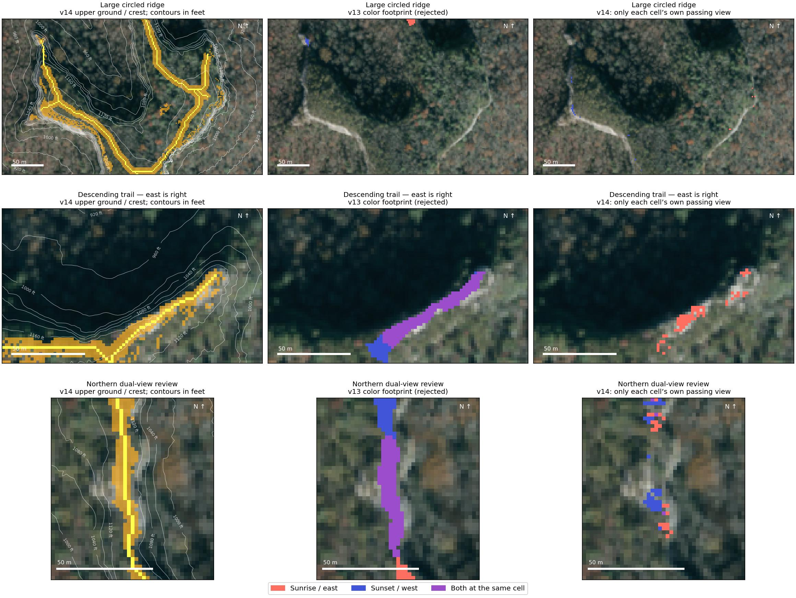
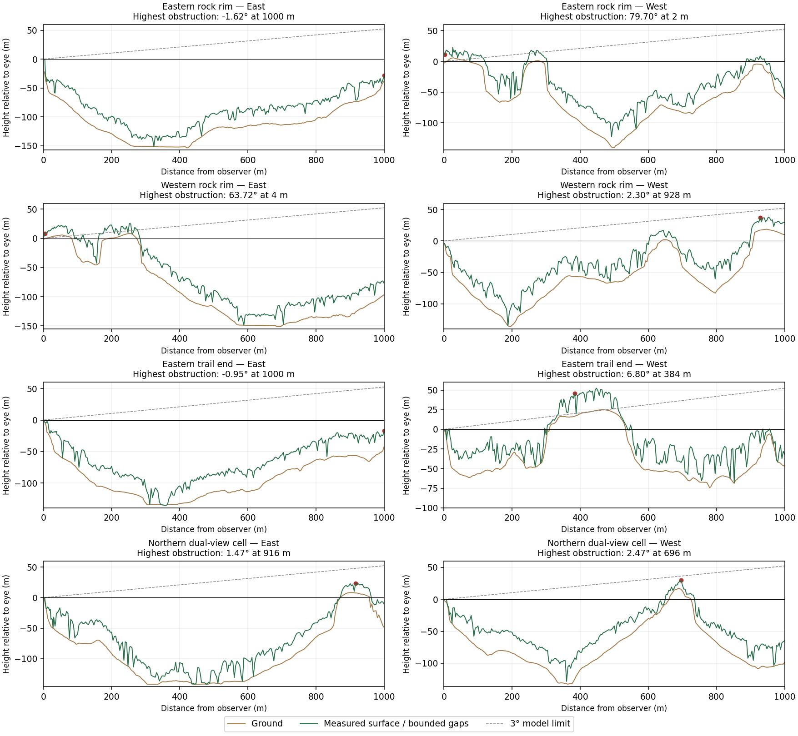

# v14 — Pinch-Em-Tight directional correction

Staging review candidate. Ryan's visual approval remains pending. Auxier is paused.

## Confirmed defects and corrections

1. **Cliff-cell height reconstruction:** v13 normalized each point against interpolated terrain, then restored that height on a different cell-center ground elevation. This inflated some cliff-edge obstructions by over 20 m. v14 keeps absolute point elevations and retains the higher classified-ground return within each cell. The original DEM, aerial array, return counts, selected 20 point-cloud tiles and query resolution are unchanged; the derived upper-ground, absolute-surface and canopy arrays have new fingerprints.
2. **Rock face versus standing top:** requiring visible rock material and low canopy in exactly the same cell missed upper lips next to bright bare faces. A connected leaf-off rock patch can now support a terrain-qualified lip within 8 m uphill and at least 1 m above it. Each viewing ray still encounters measured obstructions. Aerial imagery and trails cannot create or move crest geometry.
3. **Color propagation:** v13 could color a cell that did not pass and create purple from overlapping fades. v14 displays every cell's own result, without propagation or seed thinning. The exported PNG is checked against the independently evaluated masks; purple equals their same-cell intersection.
4. **Directional meaning:** the general exposure layer now requires due east or due west plus a neighboring ray within 5°. An oblique northwest opening no longer substitutes for a blocked west direction. This is explicitly a fixed east/west view proxy, not a date-specific seasonal sun calculation. The 3° obstruction limit and 1 km horizon remain stated limitations.
5. **Standing area versus view area:** the 16 m² connectivity requirement applies to candidate standing ground. A valid cell at its lip is retained even if adjacent standing cells have obstructed views. Near-field rays sample every 2 m through 40 m, then every 4 m. An isolated candidate pixel still fails.

## Marked-location checks

Review coordinates are used only after generation. They cannot change geometry, scores or images. The eastern trail-end review center was moved from below the cliff to its measured upper ledge; its sunrise-only requirement is restored.

| Review region | Passing sunrise cells | Passing sunset cells | Result |
|---|---:|---:|---|
| Chimney Top Rock | 0 | 21 | Sunset |
| Southern exposed outcrop | 0 | 20 | Sunset |
| Half Moon Arch outcrop | 0 | 50 | Sunset |
| Eastern trail end, 25 m review radius | 16 | 0 | Sunrise only |
| Large circle: eastern rock rim | 6 | 0 | Sunrise only |
| Large circle: western rock rim | 0 | 15 | Sunset only |
| Northern ridge review region | 11 | 22 | Includes cells passing both |

The lower fifth mark remains unverified. Its modeled sunrise is not treated as field confirmation. Across the displayed area, 175 cells pass east, 231 pass west, and **3 pass both at the same cell**. The northern dual-view review now requires actual same-cell visibility on the eligible standing footprint; it no longer requires four adjacent cells to share both views.

At the selected eastern trail-end cell, the east horizon peaks at −0.95°; the west obstruction peaks at 6.80° at 384 m, where higher ground and trees block the model's west view. Exact cells and ray measurements are in [v14-ray-evidence.json](v14-ray-evidence.json). [Acceptance results](v14-acceptance.jsonl) include whole-image invariants.

## Verification and limits

Eighteen scientific behavior tests cover crest continuity, cliff lips, absolute elevations, downhill rock association, descending spurs, blocked west versus open northwest, narrow views on standing ground, unknown coverage, independent directions and no display propagation. The initial fresh-data run reproduced every input and sightline but exposed floating-point rounding in the composite RGB blend. The renderer now assigns exact integer coral/indigo/purple values; opacity alone represents strength. A regression test checks every passing strength against the legend. The calibration workflow re-fetches the pinned sources, verifies all array fingerprints and reproduces all seven PNGs byte for byte.

These are evidence-backed model checks, not field validation or a guarantee of accessible footing. Sparse or ambiguous rock evidence, point spacing, vegetation changes and terrain beyond 1 km remain limitations. The original photos, approved route files, private/RAW data exclusions and disabled parcel layer are unaffected.
